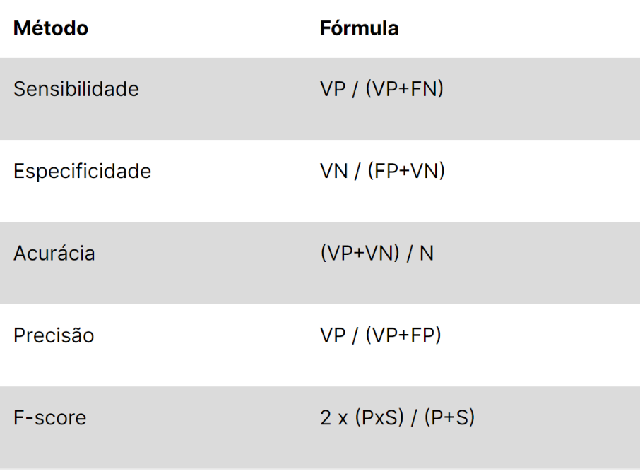

<<<<<<< HEAD
# Projetos de Aprendizado de Máquina com Python

Este repositório contém vários projetos do curso **BairesDev - Machine Learning Practitioner** disponibilizado pela plataforma Dio.me, com o objetivo de aplicar diferentes técnicas e algoritmos de aprendizado de máquina em Python. Cada projeto se concentra em um tema específico e é uma excelente oportunidade para aprender na prática.

---

## Redução de Dimensionalidade de Imagens para Redes Neurais com Python

### **Descrição do Projeto**

Este projeto aborda a **redução de dimensionalidade** em imagens coloridas, utilizando técnicas para transformá-las em escalas de cinza e binárias. Através de um exemplo de algoritmo de binarização, a imagem é convertida para níveis de cinza (0 a 255) e para binário (0 e 255).

#### **Tecnologias Utilizadas**

- PYTHON
- GOOGLE COLAB (free)

#### **Objetivo do Projeto**

A transformação de uma imagem colorida para os formatos de cinza e binário pode ser visualizada através da imagem de exemplo abaixo:

> Figura 1: Lena colorida (imagem de entrada), em níveis de cinza e preto e branca.

---

## Cálculo de Métricas de Avaliação de Aprendizado com Python

### **Descrição do Projeto**

Neste projeto, o foco é **calcular as principais métricas** para avaliação de modelos de classificação de dados. As métricas abordadas incluem **acurácia**, **sensibilidade** (recall), **especificidade**, **precisão** e **F-score**. Para calcular essas métricas, será utilizada uma matriz de confusão arbitrária, para exemplificar como cada métrica é calculada e entendida.

#### **Tecnologias Utilizadas**

- PYTHON
- GOOGLE COLAB (free)

#### **Objetivo do Projeto**

O projeto realiza o cálculo das métricas com base nos valores de **VP**, **VN**, **FP** e **FN**, e a tabela abaixo oferece uma visão geral das métricas:

> Tabela 1: Visão geral das métricas usadas para avaliar métodos de classificação. VP: verdadeiros positivos; FN: falsos negativos; FP: falsos positivos; VN: verdadeiros negativos; P: precisão; S: sensibilidade; N: total de elementos.

---

## Transfer Learning em Python - Reconhecimento de Imagens de Cães e Gatos

### **Descrição do Projeto**

Este projeto aborda o conceito de **Transfer Learning** em redes neurais utilizando Python e o ambiente **Google Colab**. A técnica de Transfer Learning é aplicada ao dataset de **cães e gatos** para a construção de um modelo de reconhecimento de imagens. O projeto foi desenvolvido com base no dataset disponibilizado pela **TensorFlow**.

#### **Tecnologias Utilizadas**

- PYTHON
- GOOGLE COLAB (free)

#### **Objetivo do Projeto**

Neste projeto, é aplicado o método de Transfer Learning em uma rede de Deep Learning. O exemplo usa o dataset de **cães e gatos**, mas você pode substituir as classes por outras de seu interesse, como imagens de sua escolha (exemplo: suas fotos ou de amigos e animais).

Para utilizar o dataset do **MNIST** no exemplo:

- Dataset de **cães e gatos**: [Cat vs Dogs Dataset](https://www.tensorflow.org/datasets/catalog/cats_vs_dogs).
- Baixe o dataset: [Download Dataset](https://www.microsoft.com/en-us/download/details.aspx?id=54765).
- Exemplo de código no Google Colab: [Transfer Learning](https://colab.research.google.com/github/kylemath/ml4a-guides/blob/master/notebooks/transfer-learning.ipynb).

Observação: Você pode também utilizar seu próprio dataset, substituindo as imagens de gatos e cachorros por outras classes de sua preferência.

---

### 📌 **Observação Geral**  
Esses projetos foram criados com fins **educacionais** no contexto do curso **BairesDev - Machine Learning Practitioner** na plataforma Dio.me. 

Os códigos e exemplos contidos nesse repositório têm como principal objetivo a **aprendizagem prática** em diferentes áreas do aprendizado de máquina com Python.
=======
# Projeto Dio - Transfer Learning em Python

## Reconhecimento de imagens de cães e gatos

Este repositório é um projeto do curso **BairesDev - Machine Learning Practitioner** disponibilizado pela plataforma Dio.me, provindo do capitulo **_Treinamento de Redes Neurais com Transfer Learning_**.

:bookmark_tabs: Sendo assim, este repositório será utilizado somente para fins de **aprendizado**.

### Tecnologias

- PYTHON
- GOOGLE COLAB (free)
___

## Descrição do projeto na plataforma Dio.me

### **Projeto de Transfer Learning em Python**

O projeto consiste em aplicar o método de Transfer Learning em uma rede de Deep Learning na linguagem Python no ambiente COLAB.  

Para exemplo, utilizaremos o seguinte projeto que realiza Transfer Learning com o Dataset do MNIST:  
   
> :link: <https://colab.research.google.com/github/kylemath/ml4a-guides/blob/master/notebooks/transfer-learning.ipynb> 

O dataset utilizado engloba duas classes: gatos e cachorros. Uma descrição da base de dados pode ser visualizada neste link:  
  
> :link: <https://www.tensorflow.org/datasets/catalog/cats_vs_dogs>. 

Já o dataset para download pode ser acessado por meio deste outro link:

> :link: <https://www.microsoft.com/en-us/download/details.aspx?id=54765>. 

Observações: Neste projeto, você pode usar sua própria base de dados (exemplo: fotos suas, dos seus pais, dos seus amigos, dos seus animais domésticos, etc), o exemplo de gatos e cachorros, pode ser substituído por duas outras classes do seu interesse. O Dataset criado em nosso projeto anterior, pode ser utilizado agora.  

O projeto deve ser enviado para o GitHub da DIO:  

> :link: <https://github.com/digitalinnovationone>.

>>>>>>> project_1-branch
